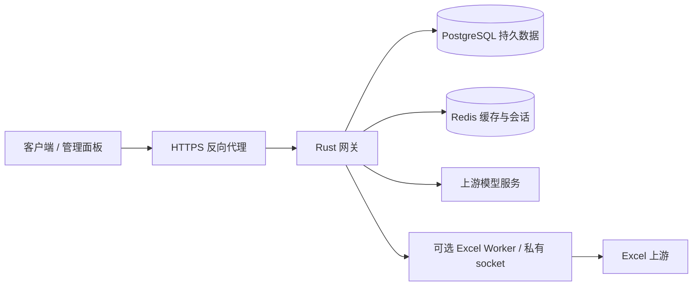

# proxy-for-self

自托管 API 网关与管理面板。统一管理上游账号、API Key、额度、路由和会话；可选 Excel Worker 提供独立适配能力。

## 项目结构

| 目录 | 职责 |
| --- | --- |
| `backend/` | Rust 网关、认证、账号调度、会话、管理 API、数据库迁移 |
| `frontend/` | Vue 3 + TypeScript 管理面板 |
| `plugins/excel-bridge/` | 可选 Python Worker，仅通过私有 Unix socket 接入网关 |
| `deploy/` | Docker、本机配置和 systemd 模板 |
| `docs/` | 架构、API、开发及部署说明 |
| `scripts/` | 通用构建工具，不自动部署 |
| `licenses/` | 保留的上游许可证 |



可以把网关理解为接待台：验证 Key，再根据账号池安排请求；数据库是账本，Redis 是短期便签，Worker 是接待台内部调用的专门工作间。

## 当前能力

- 账号自定义名称、分组、额度展示、连接测试。
- Key 绑定单账号、多个账号或动态账号组；支持继承全局、智能、轮询、额度重置优先、粘性策略。
- 新会话按策略选择账号，已有会话保持账号一致。Native 在确认额度拒绝且尚未交付输出时，可用完整历史安全切号；本地可移植历史上限 48 KiB，超限或非可移植状态需要客户端恢复，不能保证任意长对话透明切换。
- Excel Worker 使用网关提供的单次身份，不扫描桌面登录，不自行换号；不接受 `previous_response_id`，要求完整输入历史。
- 地区使用常用城市预设，时区使用下拉选项；不是全球城市数据库。
- SSE、WebSocket、管理事件流和退出排空；已包含管理 SSE 阻塞退出的修复。

## 开发与运行

需要 Rust 1.97（`backend/rust-toolchain.toml`）、Node.js 24+、pnpm 11.7、Python 3.10+（可选 Worker）、PostgreSQL 18、Redis 8。

```sh
pnpm --dir frontend install --frozen-lockfile
pnpm --dir frontend build
cp deploy/config.example.yaml deploy/config.yaml
# 按 deploy/README.md 设置数据库、Redis、管理员密码及 vault 密钥
cd backend
cargo run --locked --bin codex-proxy-rs
```

本地构建：`bash scripts/build.sh`。这只生成产物，不会更新生产服务。

- [开发与多人协作](CONTRIBUTING.md)
- [部署与升级](deploy/README.md)
- [架构边界](docs/architecture.md)
- [管理 API](docs/api.md)

## 许可证与来源

Rust/Vue 部分及本仓库通用新增代码遵循 [Apache-2.0](LICENSE)；Python Excel 适配部分保留 [Unlicense](plugins/excel-bridge/LICENSE)。来源与修改说明见 [NOTICE](NOTICE)。这是独立维护的产品仓库，保留内部 crate、模块和协议标识以兼容已有数据。

仓库不包含线上账号、密钥、数据库、备份和本机配置。版本从 `0.1.0` 开始独立管理；当前源码整理不代表已部署此版本，也未发布可供面板自动升级的发行包。
